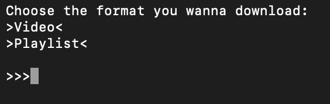
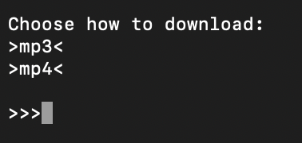

# Youtube Downloader 

This is a python script which download youtube video and playlsit as mp3 or mp4

------------
**DISCLAIMER:**
This script is only for **educational purpose**, downloading YouTube video is **AGAINST** copyright and YouTube's terms. **The autor of this tool do not take any responsibility** for your usage.

------------
## INSTALLATION ⚙️
1. Install python (preferably one of the indicated versions) if your systemn does not already have python

2. Download or clone the repository:

    `git clone https://github.com/En7ity303/youtube-downloader.git`

3. Install the requirements:

    `pip3 install -r requirements.txt`

4. You are ready to use the program

-----------
## USAGE 🔧
This script is surely usable with the elencated versions of Python which i have tested on my own, if you have a different version of python you can try to use the tool but it may not function properly 

-----------
You can choose to download a video or a playlist

And you can choose to download in mp3 or mp4 format after you have insert the youtube link

## ATTENTION ⚠️🚨
Now there is a problem with pytube 15.0.0 I sugest to momentary use older versions of pytube such as 12.1.3 trought this command:

`pip3 install pytube==12.1.3`

if you really want to use the version 15.0.0 you must follow this guide https://github.com/pytube/pytube/issues/1712

## ATTENTION ⚠️🚨
Now there is an issue with python 3.12.X on macOS system so if you have a macOS device you must use 3.11.8 or above 
